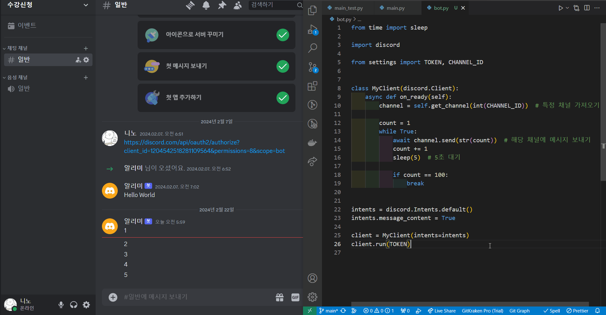

# 디스코드 봇 튜토리얼

참고: https://yunwoong.tistory.com/212

## 사용
1. settings.py 파일을 만든다.
2. 안에 TOKEN과 CHANNEL_ID를 입력해준다.
    ```python
    TOKEN = "ABCD1234EFGH5678..."
    CHANNEL_ID = "1204544..."
    ```
3. example에 있는 예제를 실행하면 된다.

## 팁
- 디스코드 봇을 만들어서 알림을 보낼 예정.  
  문제는 봇 행동 방식을 지정한 프로그램을 꺼버리면, 봇이 작동을 멈춤.
  <details>
  <summary>예시: 5초마다 카운팅하는 걸 중간에 끈 경우</summary>

    
  </details>

  ⇒ **스마트폰을 서버로** 이용하고, **Termux**를 통해 프로그램 구동하기
